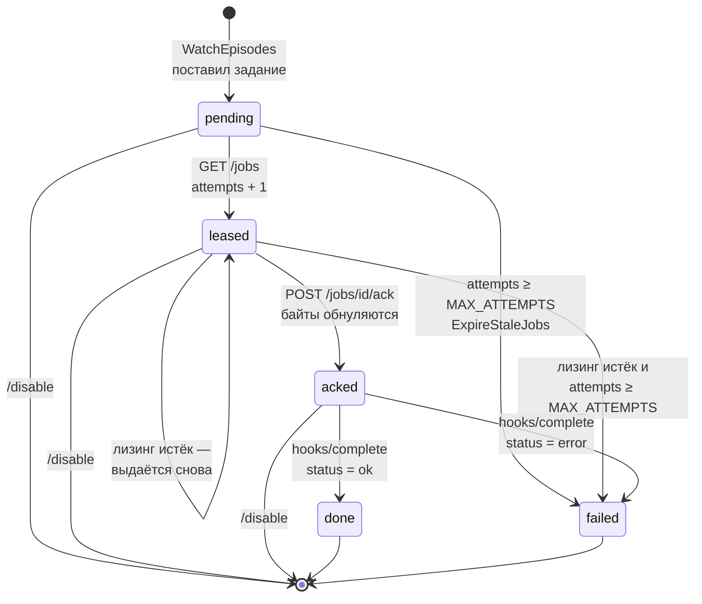

# Как это устроено

## Одним абзацем

Один процесс PHP на ReactPHP. Он периодически читает RSS LostFilm, для новых серий
проходит цепочку резолва до файла `.torrent`, кладёт байты в SQLite как задание
и уведомляет в Telegram. Скачиванием занимается **внешний клиент на другой машине**:
он забирает задания по HTTP, качает и отчитывается о результате. Три сущности
живут в одном event loop и делят одну базу.

## Три источника событий

| Источник              | Что делает                                             | Период                                     |
|-----------------------|--------------------------------------------------------|--------------------------------------------|
| Таймер ленты          | `WatchEpisodes::run()`, затем `ExpireStaleJobs::run()` | `RSS_POLL_INTERVAL`, по умолчанию 900 с    |
| HTTP-сервер           | `ApiRouter` для скачивающего клиента                   | порт `HTTP_PORT`, по умолчанию 8080        |
| Long-polling Telegram | `PollTelegram` → `Commands`                            | самоперезапускающаяся цепочка, без таймера |


## Жизненный цикл задания



## Конфигурация

Только переменные окружения (`Config::fromEnv`), файла конфигурации нет.

| Переменная                       | Обязательна  | По умолчанию   | Назначение                                   |
|----------------------------------|--------------|----------------|----------------------------------------------|
| `LF_SESSION` / `LF_SESSION_FILE` | одна из двух | —              | cookie lostfilm: значением или путём к файлу |
| `TELEGRAM_TOKEN`                 | да           | —              | токен бота                                   |
| `TELEGRAM_CHATS`                 | нет          | пусто          | список chat_id через запятую                 |
| `API_TOKEN`                      | да           | —              | bearer для всего API, кроме `/health`        |
| `QUALITY`                        | нет          | `MP4`          | `SD`, `1080` или `MP4`                       |
| `RSS_POLL_INTERVAL`              | нет          | `900`          | период опроса ленты, с                       |
| `LEASE_TTL`                      | нет          | `600`          | срок лизинга задания, с                      |
| `MAX_ATTEMPTS`                   | нет          | `5`            | выдач до пометки `failed`                    |
| `DB_PATH`                        | нет          | `/data/amd.db` | файл SQLite                                  |
| `HTTP_PORT`                      | нет          | `8080`         | порт API                                     |

## Команды бота

| Команда                   | Действие                                            |
|---------------------------|-----------------------------------------------------|
| `/list`                   | сериалы, встречавшиеся в ленте, с отметкой слежения |
| `/enable <название\|id>`  | следить за сериалом                                 |
| `/disable <название\|id>` | перестать следить и снять незавершённые задания     |
| `/status`                 | количество заданий по каждому статусу               |
| `/help`, `/start`         | справка                                             |

## Запуск и проверка

```
composer install
vendor/bin/phpunit                                   весь набор, кроме @group live

docker compose up -d --build                         демон в контейнере
curl -s localhost:8080/health                        {"status":"ok"}
docker compose logs --tail 20
```

`--build` обязателен после правки исходников: в `compose.yaml` смонтирован только
каталог данных (`./data:/data`), код запечён в образ.
